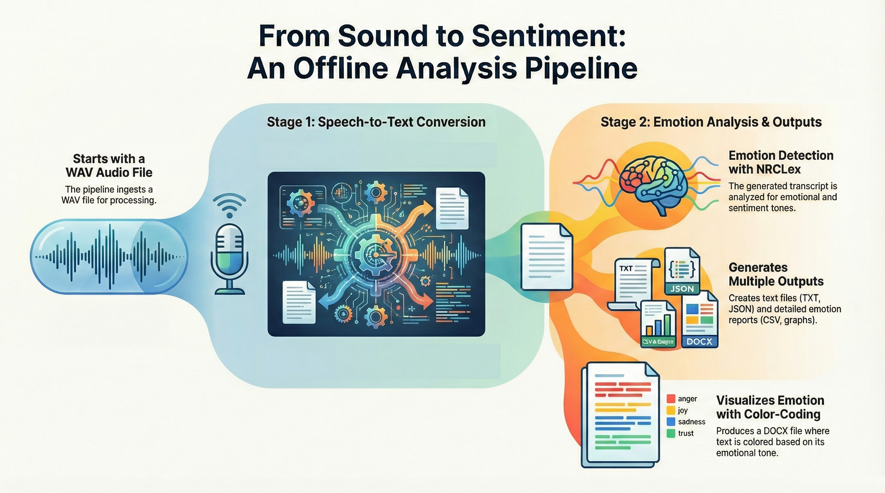

# *Offline Speech-to-Text and Emotion Analysis*

## *Descriptions*

This Python project provides a complete offline speech-to-text and emotion analysis pipeline.
It converts WAV audio files into structured text formats (TXT, JSON, DOCX) using the Vosk speech recognition engine, 
enhanced by silence-based segmentation for natural line breaks. The transcription is then refined with automatic punctuation restoration and sentence capitalization for better readability.

In addition, the program performs emotion detection and sentiment analysis using NRCLex, generating detailed emotion reports (CSV, graphs, and color-coded DOCX documents)
that visually represent the emotional tone of the transcript.

This tool can be used for offline meeting transcription, podcast or interview analysis, and emotional insight extraction without requiring internet connectivity.

## I will add other tools in the future...

