# *Offline Speech-to-Text and Emotion Analysis*

[](https://github.com/lemoinep/OfflineSpeechToTextAndEmotionAnalysis)
[](LICENSE)
[](https://www.python.org/)

---


## *Descriptions*

<p align="center">
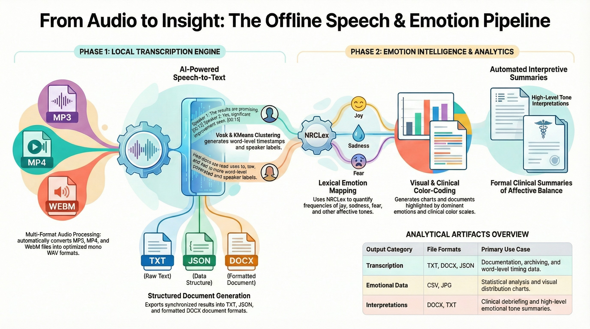
</p>

This Python project provides a complete offline speech-to-text and emotion analysis pipeline.

OfflineSpeechToTextAndEmotionAnalysis.py is a standalone tool that converts offline audio recordings into readable transcripts and automatically analyses their emotional content. It is designed for clinicians, researchers, and developers who need an end‑to‑end pipeline from raw speech to structured text, visual reports, and written emotion summaries.

The program first parses command‑line arguments to configure the input file, Vosk speech model, chunk size, punctuation and speaker options, and whether to enable emotion analysis. It then prepares the input by detecting the file type, converting mp3/mp4/webm to mono 16 kHz WAV with ffmpeg if needed, or bypassing transcription when a plain text file is provided.

For audio inputs, the core engine runs an offline Vosk recognizer to perform speech‑to‑text with word‑level timestamps, optionally enriched with speaker embeddings for basic diarization. A light speaker‑clustering module can then regroup raw speaker IDs into a fixed number of main speakers using KMeans, enabling simple multi‑speaker transcripts. The system builds a word timeline and segments the transcript into lines based on pauses and speaker changes, then optionally restores punctuation and capitalization to generate a more natural, human‑readable text.

The transcription stage produces several synchronized outputs: a plain TXT transcript, a version with speaker labels, a JSON file containing the full Vosk results and word‑level timing, and a DOCX document with basic formatting. These artifacts can be reused in downstream analysis, documentation, or clinical workflows.

When emotion analysis is enabled, the program applies NRCLex to the transcript to compute lexical emotion frequencies (e.g., fear, anger, joy, sadness, positive, negative) and exports them as CSV reports. It then generates bar and donut charts of the emotion distribution, as well as two emotion‑colored DOCX documents: one highlighting the dominant emotion per sentence, and another using an aggregated, clinically inspired color scale.

Finally, the tool creates two textual summaries from the emotion report: a general, high‑level interpretation of the emotional tone, and a more clinically oriented summary that describes broader affective balance and salient emotions while explicitly stating its limitations. Together, these components provide an integrated offline pipeline from raw speech to interpretable emotional insights, without relying on cloud services.


<p align="center">
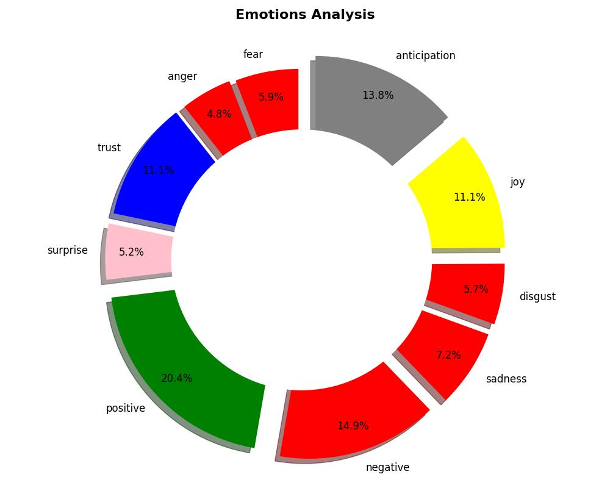
</p>


This tool can be used for offline meeting transcription, podcast or interview analysis, and emotional insight extraction without requiring internet connectivity.

---

## Conceptual Diagram: Program Structure

```
+--------------------------------------------------------+
| OfflineSpeechToTextAndEmotionAnalysis                  |
| Role: end-to-end offline speech-to-text + emotions     |
|       analysis pipeline                                |
+------------------------+-------------------------------+
                         |
                         v
+--------------------------------------------------------+
| 1. Input & Configuration                               |
| Role: collect parameters and prepare inputs            |
| - Parse CLI args (Path, Name, Model, chunk_size,       |
|   no-punct, emotions_analysis, silence_threshold,      |
|   enable_speakers, target_speakers)                    |
| - Build paths (script dir, Models/<Model>, input file) |
| - Detect input type (WAV / mp3 / mp4 / webm / txt)     |
| - If mp3/mp4/webm: convert to mono 16 kHz WAV (ffmpeg) |
| - If txt: disable transcription (qtranscribe = False)  |
+------------------------+-------------------------------+
                         |
                         v
+--------------------------------------------------------+
| 2. Transcription Controller                            |
| Role: orchestrate Vosk transcription pipeline          |
| - If qtranscribe = False: skip to Emotion Analysis     |
| - Else: call transcribe(audio_file, MODEL_PATH,        |
|   outputs, chunk_size, punctuation, speakers, etc.)    |
+------------------------+-------------------------------+
                         |
                         v
+--------------------------------------------------------+
| 3. ASR & Speaker Processing                            |
| Role: convert audio to timed words + speakers          |
| - Load Vosk acoustic model (and speaker model if any)  |
| - Open WAV and check mono 16-bit PCM format            |
| - Stream audio by chunks into KaldiRecognizer          |
| - For each full result:                                |
|     * Parse JSON                                       |
|     * Optionally assign speaker_id from embeddings     |
|     * Accumulate raw_results and text_chunks           |
| - After FinalResult:                                   |
|     * Build full_text                                  |
|     * Extract word list with start/end/speaker         |
| - Optionally recluster speakers with KMeans to         |
|   target_speakers and remap IDs                        |
+------------------------+-------------------------------+
                         |
                         v
+--------------------------------------------------------+
| 4. Segmentation & Punctuation                          |
| Role: structure transcript into readable lines         |
| - From word timeline:                                  |
|     * Build lines using silence_threshold gaps         |
|     * If speakers enabled: prefix "Speaker k:"         |
| - Optionally restore punctuation (PunctuationModel)    |
|   line by line                                         |
| - Apply capitalization after punctuation and at line   |
|   starts                                               |
+------------------------+-------------------------------+
                         |
                         v
+--------------------------------------------------------+
| 5. Transcription Outputs                               |
| Role: persist transcript in multiple formats           |
| - Write TXT transcript (no speakers)                   |
| - Write TXT transcript with speaker labels             |
| - Write JSON: raw Vosk results + word timeline         |
| - Generate DOCX transcript with heading and paragraphs |
+------------------------+-------------------------------+
                         |
                         v
+--------------------------------------------------------+
| 6. Emotion Analysis Core                               |
| Role: compute lexical emotion distribution             |
| - Read transcript TXT                                  |
| - Build NRCLex object                                  |
| - Export affect_dict -> *_Report_Analysis.csv          |
| - Export affect_frequencies -> *_Report.csv            |
| - Load *_Report.csv into DataFrame                     |
| - Prepare emotion labels (X) and frequencies (Y)       |
+------------------------+-------------------------------+
                         |
                         v
+--------------------------------------------------------+
| 7. Emotion Visualization & Highlighting                |
| Role: create graphical and color-coded reports         |
| - Generate bar chart *_Report.jpg                      |
| - Generate donut pie chart *_Pie_Report.jpg            |
| - DOCX 1: sentence-level dominant emotion color        |
|   (single emotion -> mapped color, else white)         |
| - DOCX 2: clinical color map from EMOTION_SIGNS        |
|   (dark red / red / violet / gray / green / bright     |
|    green / white depending on score)                   |
+------------------------+-------------------------------+
                         |
                         v
+--------------------------------------------------------+
| 8. Emotion Summaries                                   |
| Role: produce textual interpretations of emotions      |
| - summarize_emotions_report():                         |
|     * Normalize frequencies                            |
|     * Compute positive vs negative scores              |
|     * Determine overall tone (positive/negative/mixed) |
|     * Describe main emotions and give simple remarks   |
| - summarize_emotions_report_clinical():                |
|     * Broad positive/negative/neutral valence          |
|     * Clinical-style tone (predominantly positive,     |
|       negative, or mixed)                              |
|     * Add cautious clinical considerations + disclaimer|
+--------------------------------------------------------+
                        

```
---

## For more information

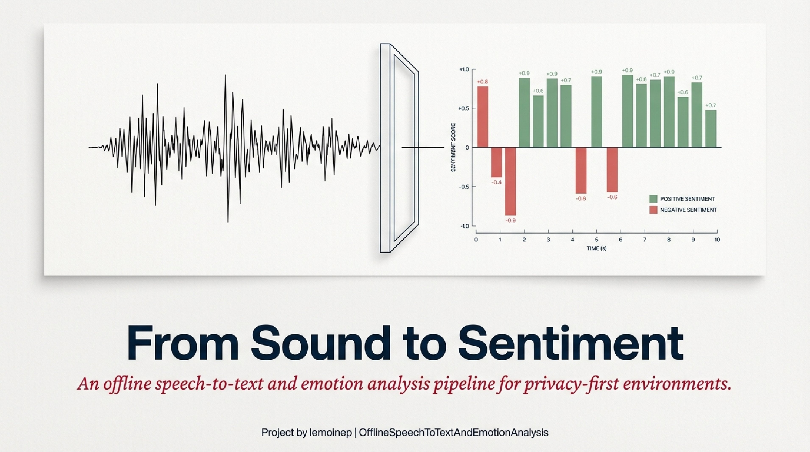
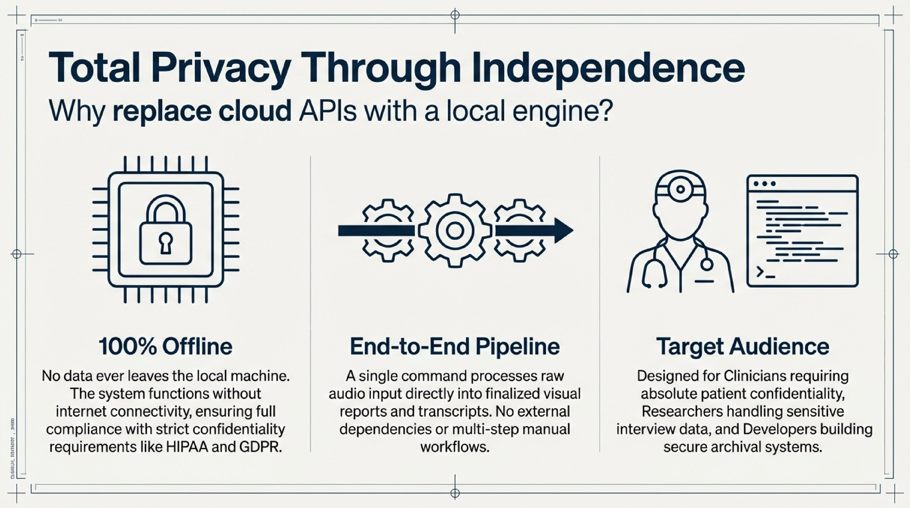
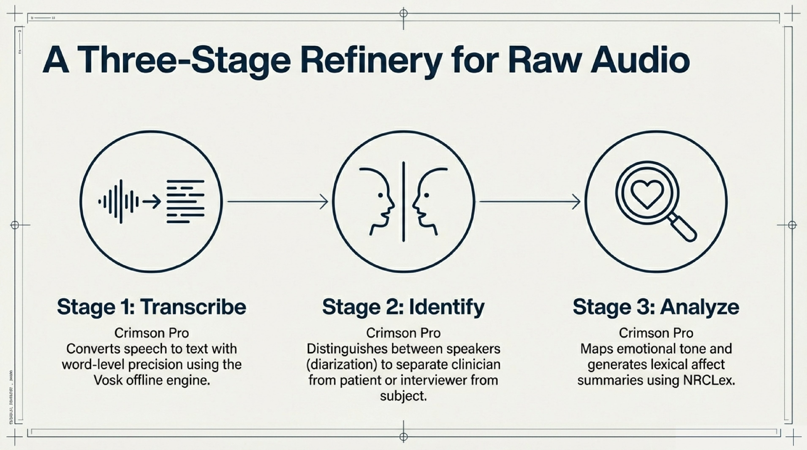
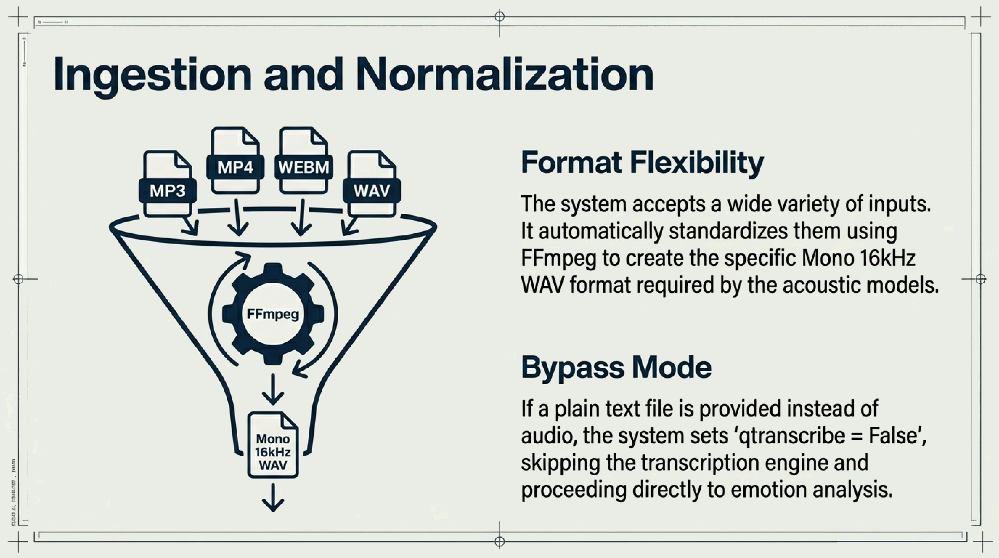
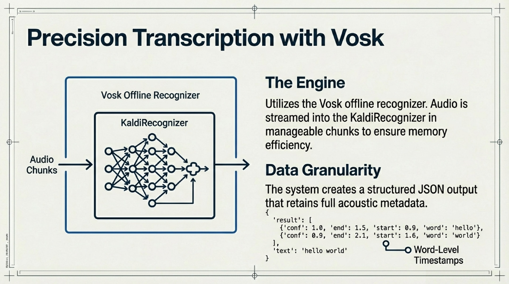
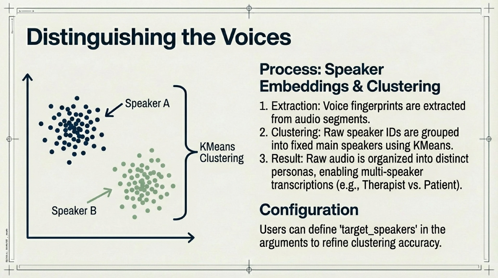
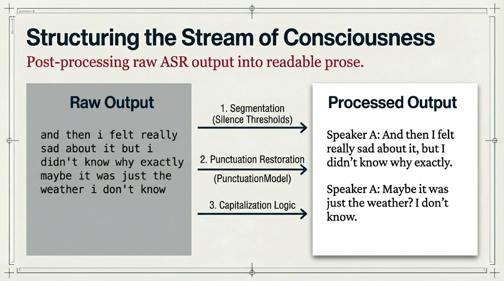
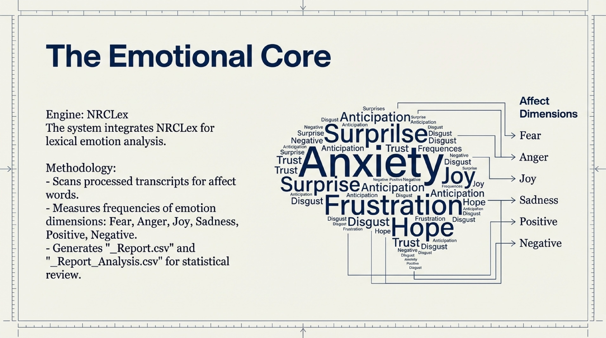
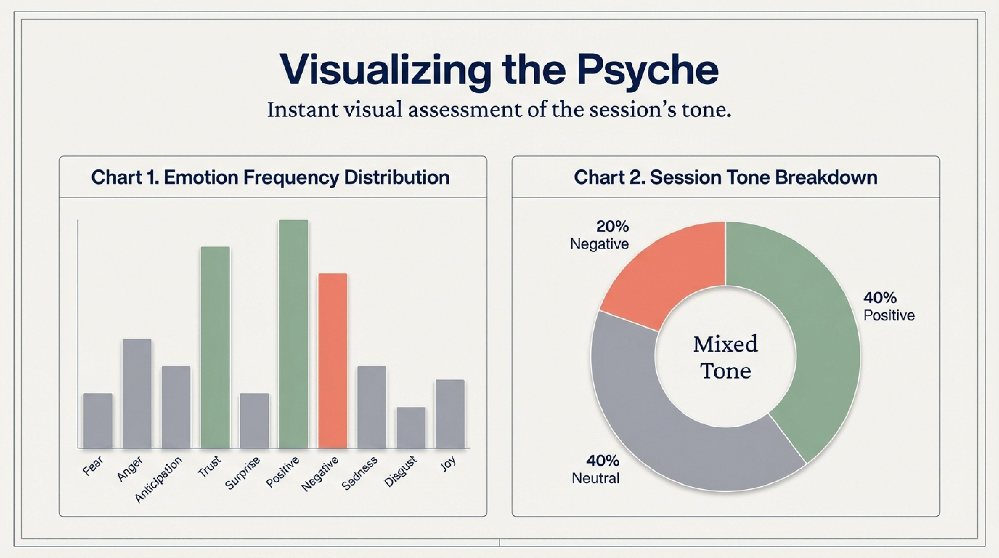
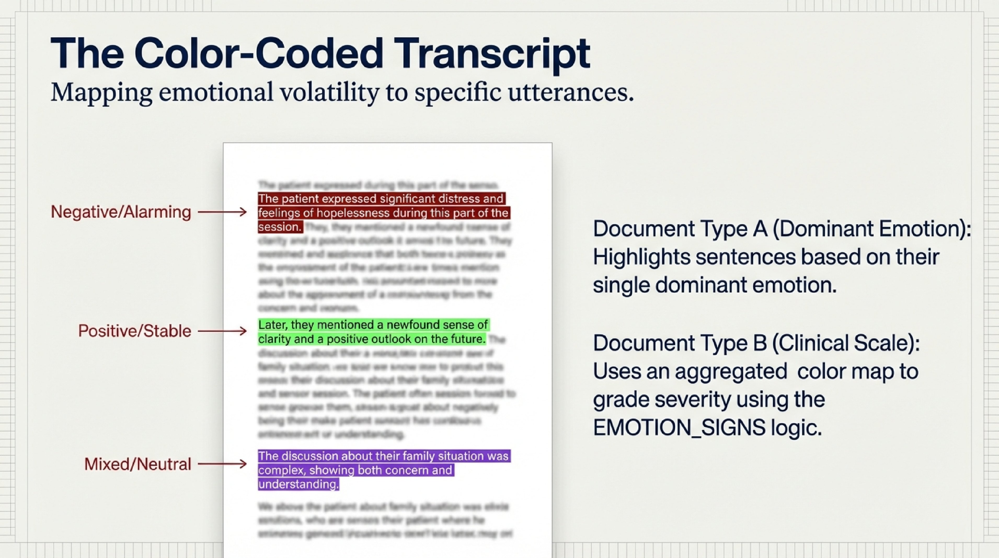
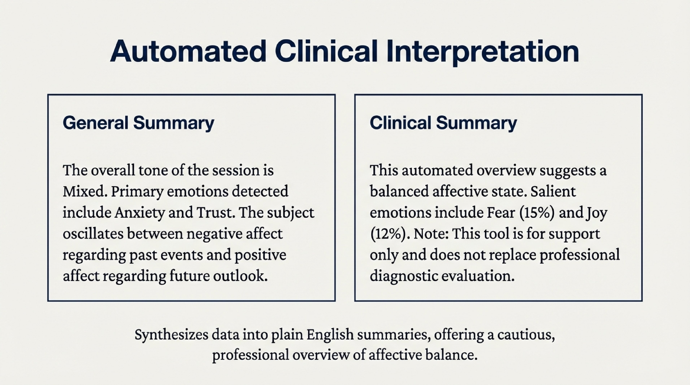
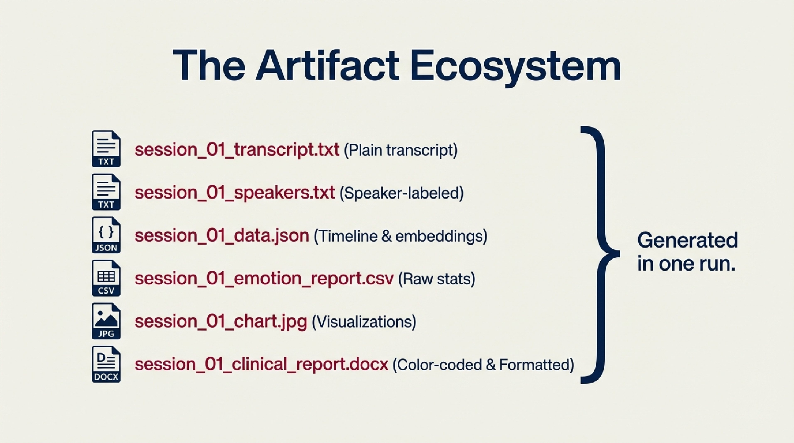
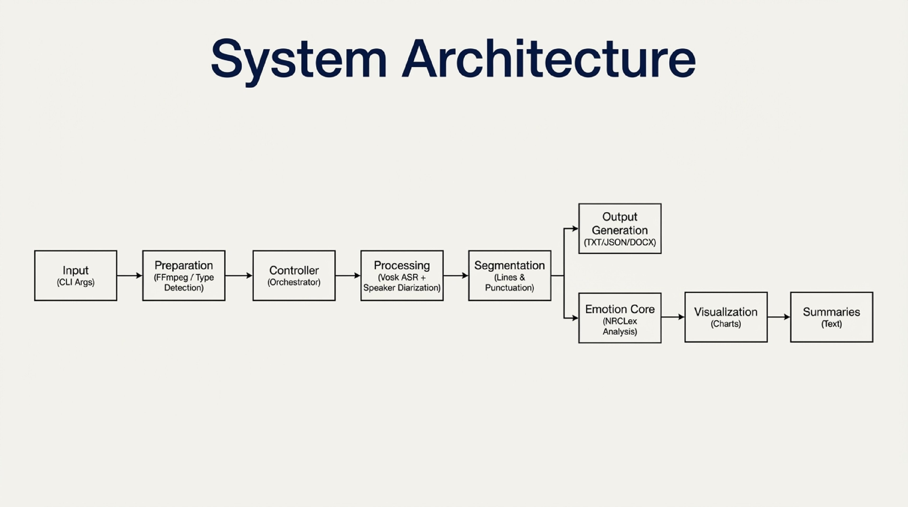
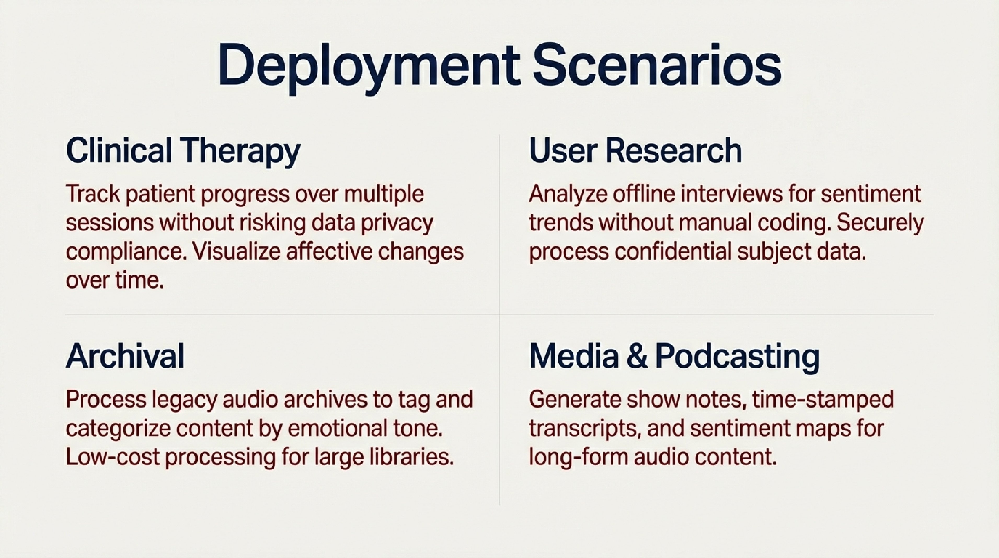
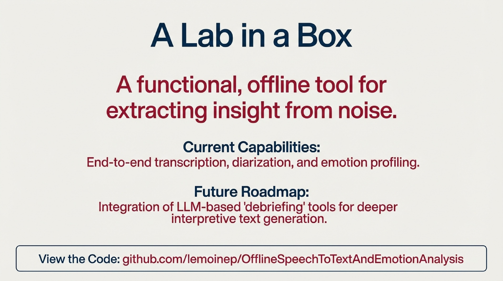

---

## I will add other tools in the future...

For now we have the graphs, so I will add a kind of debriefing in the form of text later to interpret the results...

---

## 📝 **Author**

**Dr. Patrick Lemoine**  
*Engineer Expert in Scientific Computing*  
[LinkedIn](https://www.linkedin.com/in/patrick-lemoine-7ba11b72/)

---